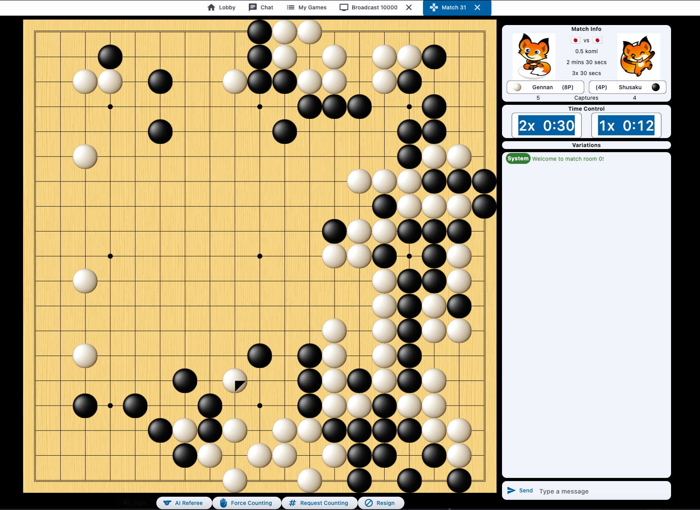
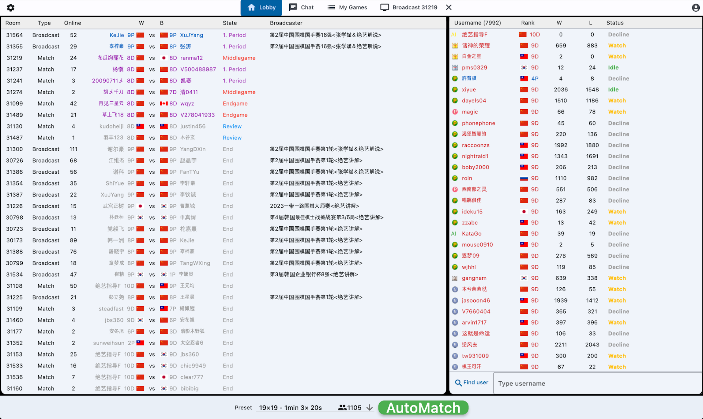

# openfoxwq_client

<p align="center">
  <a href="https://discord.gg/RG2KquNWKE">
    </a>
  <a href="https://www.buymeacoffee.com/ale64bit" target="_blank"></a>
</p>

A multiplatform unofficial client for Fox go server ([foxwq](https://www.foxwq.com/)) written in [Flutter](https://flutter.dev/).

The web version is currently hosted at https://openfoxwq.com. 

Native builds for Mac available at [openfoxwq_dist](https://github.com/openfoxwq/openfoxwq_dist) repository.

# Screenshots



# Development
I use the beta channel for Flutter. There are two environment variables which can be helpful during development:
- `MOCK_UI`: a boolean flag to control whether the application is launched in mock UI mode. In this mode, the application doesn't connect to the backend but instead uses mock data to display relevant parts of the UI which can be modified and hot-reloaded for fast development. It can be used from the terminal
  ```sh
  $ flutter run --dart-define=MOCK_UI=true
  ```
  or setup in your code editor (e.g. VSCode).
- `PROXY_URL`: overrides the URL of the proxy. By default it uses the production backend endpoint. Currently the proxy is not open-source, though.
